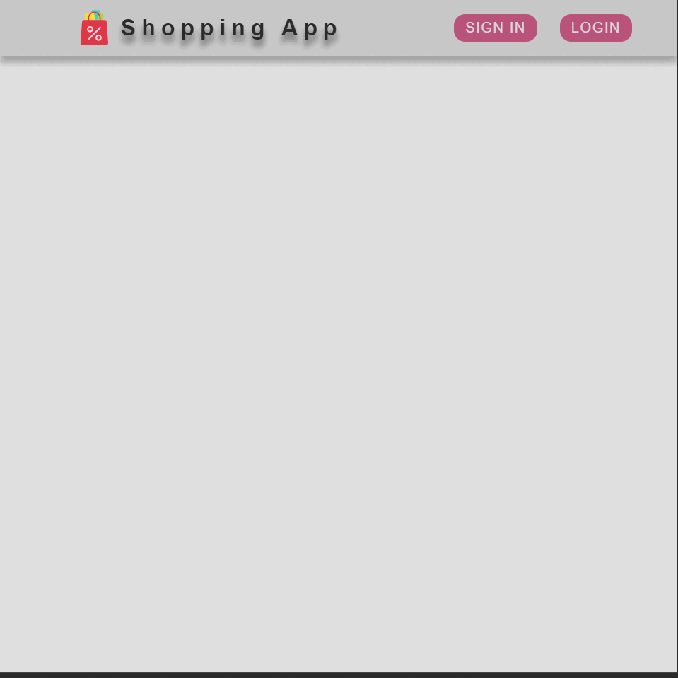

**_
React JS Projects Series | 5 - Food Order
_**

 

In this application, user registration is provided in a database created by using the firebase application and user login is provided by controlling the user login on the server.

 

  
   

 

The content of the Create User List application;

- React JS
- Hooks
- AJAX Calls
- useReduce
- useState
- useContext
- Handler Functions
- JSX
- Basic JS
- Basic HTML
- Basic CSS
